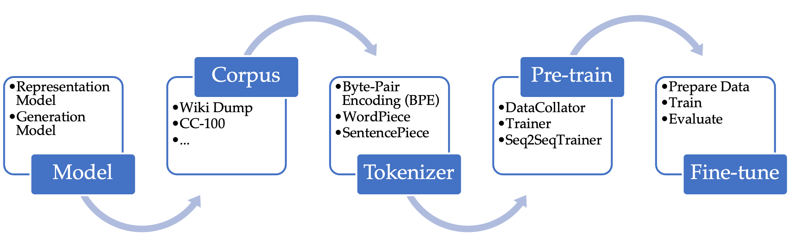

<!-- # Project

> This repo has been populated by an initial template to help get you started. Please
> make sure to update the content to build a great experience for community-building.

As the maintainer of this project, please make a few updates:

- Improving this README.MD file to provide a great experience
- Updating SUPPORT.MD with content about this project's support experience
- Understanding the security reporting process in SECURITY.MD
- Remove this section from the README -->

# Pre-train and Fine-tune Language Model with Hugging Face 

Pre-trained language model is an important infrastructure capability which can support many different use cases, such as classification, generation, etc. Many current monolingual models focus on English while there are customers speaking different languages who have the need of these pre-trained models for various use cases. In addition, multilingual models may not have the ideal performance for some downstream tasks in certain languages and thus one may also want to pre-train another monolingual model for some specific language to improve the performance. 

This is a general guideline of pre-training and fine-tuning language models using [Hugging Face](https://huggingface.co/). For illustration, we use pre-training language models for question generation (answer-agnostic) in Korean as running example.

## General Guideline

Figure above shows the overview of pre-training and fine-tuning with Hugging Face. Specifically, one can follow the steps summarized below.

1. **Choose the model.** Hugging Face [Transformers](https://huggingface.co/docs/transformers/index) provides tons of state-of-the-art models across different modalities and backend (we focus on language models and PyTorch for now). Roughly speaking, language models can be grouped into two main classes based on the downstream use cases. (Check this [list](https://huggingface.co/docs/transformers/index#supported-models) for supported models on Hugging Face.)
    - Representation models are more suitable for classification tasks such as named-entity recognition. For example,
        - [BERT](https://huggingface.co/docs/transformers/model_doc/bert)
        - [RoBERTa](https://huggingface.co/docs/transformers/model_doc/roberta)
        - [DeBERTa-v2](https://huggingface.co/docs/transformers/model_doc/deberta-v2) (Turing NLR v4)
    - Generation models are more suitable for generation tasks such as translation. For example,
        - [BART](https://huggingface.co/docs/transformers/model_doc/bart) / [mBART](https://huggingface.co/docs/transformers/model_doc/mbart)
        - [T5](https://huggingface.co/docs/transformers/model_doc/t5) / [mT5](https://huggingface.co/docs/transformers/model_doc/mt5)
        - [ProphetNet](https://huggingface.co/docs/transformers/model_doc/prophetnet) / [XLM-ProphetNet](https://huggingface.co/docs/transformers/model_doc/xlm-prophetnet)

2. **Prepare the pre-train corpus.** Hugging Face [Datasets](https://huggingface.co/docs/datasets/index) provides useful toolkits to prepare and share data for different use cases (again we focus on NLP for now). Check this [tutorial](https://huggingface.co/docs/datasets/tutorial) to get started. There are also many public resources that could be considered as potential corpus (some of them are also available from Hugging Face, check this [page](https://huggingface.co/datasets)). For example,
    - [Wiki Dump](https://dumps.wikimedia.org/): A complete copy of all Wikimedia wikis.
    - [CC-100](http://data.statmt.org/cc-100/): Constructed using the urls and paragraph indices from [CC-Net repository](https://github.com/facebookresearch/cc_net) by processing January-December 2018 Commoncrawl snapshots.

3. **Train the tokenizer.** Once the model is chosen and pre-train corpus is prepared, one may also want to train the tokenizer (associated with the model) on the pre-train corpus from scratch. Hugging Face [Tokenizers](https://huggingface.co/docs/tokenizers/index) provides the pipeline to train different types of tokenizers. Follow this [example](https://huggingface.co/docs/tokenizers/pipeline) to get started. Some commonly used tokenizers include 
    - [Byte-Pair Encoding (BPE)](https://huggingface.co/docs/tokenizers/components#models)
    - [WordPiece](https://huggingface.co/docs/tokenizers/components#models)
    - [SentencePiece](https://github.com/google/sentencepiece)

4. **Pre-train the model.** Hugging Face [Transformers](https://huggingface.co/docs/transformers/index) also provides convenient wrapper for training deep neural networks. In particular, 
    - [DataCollator](https://huggingface.co/docs/transformers/main_classes/data_collator): There are many pre-defined DataCollator that can meet the requirements of different models and pre-train task (objective). One can also build customized DataCollator upon the existing ones if needed. 
    - [TrainingArguments/Trainer](https://huggingface.co/docs/transformers/main_classes/trainer): With the convenient wrapper for training loop, one can simply specify hyperparameters (learning rate, batch size, etc) in TrainingArguments and pass them, along with the chosen model,  pre-train corpus and trained tokenizer, to Trainer for training. One can also build customized Trainer upon the existing ones if needed.
    - [Seq2SeqTrainingArguments/Seq2SeqTrainer](https://huggingface.co/docs/transformers/main_classes/trainer): Similar wrapper as above for sequence-to-sequence models.

5. **Fine-tune the model.** Depending on the use case, one can now fine-tune the pre-trained model for different downstream tasks.
    - Prepare data: similarly as before, HuggingFace.Datasets can be used to prepare and share data.
    - Train: similarly as before, HuggingFace.Transformers (DataCollator, Trainer, etc) can be used to train the model.
    - Evaluate: Hugging Face [Evaluate](https://huggingface.co/docs/evaluate/index) includes lots of commonly used metrics for different domains (again we focus on NLP for now). Check this [tour](https://huggingface.co/docs/evaluate/a_quick_tour) to get started and this [page](https://huggingface.co/evaluate-metric) for the list of supported metrics.

## Example

For our running example, the specification is summarized as follows (one can also use our script as the simple template and replace with different model/data/etc to get started).

1. **Choose the model.** As our use case is question generation (answer-agnostic) in Korean, we consider the [ProphetNet](https://arxiv.org/abs/2001.04063) / [XLM-ProphetNet](https://arxiv.org/abs/2104.08006) model and the goal is to provide ProphetNet-Ko (Base/Large) model checkpoints that could be fine-tuned for question generation in Korean.

2. **Prepare the pre-train corpus** ([script](./script/prepare_corpus.py) for preparing corpus)**.** In addition to [Wiki Dumps](https://dumps.wikimedia.org/) and [CC-100](http://data.statmt.org/cc-100/) mentioned before, we also consider the following sources for our pre-train corpus:
    - [NamuWiki](https://github.com/lovit/namuwikitext): Namu Wikipedia in a text format.
    - [Petition](https://github.com/lovit/petitions_archive): Data collected from the Blue House National Petition (2017.08 ~ 2019.03).

    The base pre-train corpus is around 16GB and the large pre-train corpus is around 75GB.

3. **Train the tokenizer** ([script](./script/train_tokenizer.py) for training the tokenizer)**.** We train the (base/large) SentencePiece tokenizer (associated with XLM-ProphetNet) with vocabulary size of 32K on the (base/large) pre-train corpus.

4. **Pre-train the model** ([script](./script/prepare_pretrain_data.py) for preparing pre-train data and [script](./script/prophetnet-ko_pretrain.py) for pre-training)**.** We define our customized DataCollator and Seq2SeqTrainer to adopt the future n-gram prediction objective (a new sequence-to-sequence pre-train task proposed by this [paper](https://arxiv.org/abs/2001.04063)). We pre-train base model (~125M parameters) on 16GB base corpus and large model (~400M parameters) on 75GB large corpus.

5. **Fine-tune the model** ([script](./script/prepare_finetune_data.py) for preparing fine-tune data and [script](./script/prophetnet-ko_finetune.py) for fine-tuning)**.** As our downstream task is question generation (answer-agnostic), we consider [KLUE-MRC](https://klue-benchmark.com/tasks/72/overview/description) and [KorQuAD v1.0](https://huggingface.co/datasets/squad_kor_v1) as potential datasets for fine-tuning. We use [BLEU](https://en.wikipedia.org/wiki/BLEU) scores as evaluation metrics.

## Contributing

This project welcomes contributions and suggestions.  Most contributions require you to agree to a
Contributor License Agreement (CLA) declaring that you have the right to, and actually do, grant us
the rights to use your contribution. For details, visit https://cla.opensource.microsoft.com.

When you submit a pull request, a CLA bot will automatically determine whether you need to provide
a CLA and decorate the PR appropriately (e.g., status check, comment). Simply follow the instructions
provided by the bot. You will only need to do this once across all repos using our CLA.

This project has adopted the [Microsoft Open Source Code of Conduct](https://opensource.microsoft.com/codeofconduct/).
For more information see the [Code of Conduct FAQ](https://opensource.microsoft.com/codeofconduct/faq/) or
contact [opencode@microsoft.com](mailto:opencode@microsoft.com) with any additional questions or comments.

## Trademarks

This project may contain trademarks or logos for projects, products, or services. Authorized use of Microsoft 
trademarks or logos is subject to and must follow 
[Microsoft's Trademark & Brand Guidelines](https://www.microsoft.com/en-us/legal/intellectualproperty/trademarks/usage/general).
Use of Microsoft trademarks or logos in modified versions of this project must not cause confusion or imply Microsoft sponsorship.
Any use of third-party trademarks or logos are subject to those third-party's policies.

